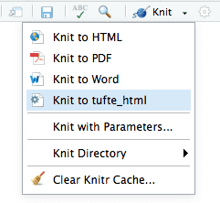

# Introduction

Có thể bạn đã từng sử dụng Latex, Word hoặc PowerPoint để tạo Slide, Report. Nhưng các phần mềm này có nhược điểm là không thể tái tạo lại các kết quả phân tích dữ liệu khi đầu vào thay đổi. Trong bài này, tôi cùng các bạn sẽ đi tìm hiểu về R Markdown. Một Package trong R cho phép tạo các Dynamic documents có khả năng Reproducible.

## Cài đặt Packages

```{r eval=FALSE}
# install from CRAN
install.packages('rmarkdown')

# install from GitHub
devtools::install_github('rstudio/rmarkdown')
```

## Build

Để build kết quả từ một file R Markdown, trong RStudio click nút `Knit`.

<center>

</center>

## Output format

R Markdown có nhiều kiểu tài liệu như Documents, Presentations,...Trong bài này, tôi chỉ tập chung vào ba kiểu định dạng sau:

- HTML Document
- Presentation Ninja
- Bookdown

Với các định dạng khác, các bạn có thể tham khảo: [Rmarkdown](https://rmarkdown.rstudio.com/formats.html) hoặc [Book](https://bookdown.org/yihui/rmarkdown/).

# Basics

## Markdown Syntax

### Ngắt dòng

Để ngắt dòng trong Markdown chúng ta sử dụng hai dấu cách ở cuối đoạn cần ngắt.

### Tiêu đề:

```
# H1
## H2
### H3
#### H4
...

# Header không đánh số {-}
```

### Định dạng:

```
text
*text*
**text**
~~text~~

H~3~PO~4~
Cu^2+^
```

Kết quả:

- text
- *text*
- **text**
- ~~text~~
- H~3~PO~4~
- Cu^2+^

### Code

- code trong đoạn văn: `code in line`
- đoạn code:

````
```
code 1
code 2
```
````

Kết quả

```
code 1
code 2
```

### Quote

```
> block quote
```

Kết quả:

> block quote

> Block quote line 1  
> Block quote line 2

> "I thoroughly disapprove of duels. If a man should challenge me,
  I would take him kindly and forgivingly by the hand and lead him
  to a quiet place and kill him."
>
> --- Mark Twain

### List

**Ordered List:**

```
1. One item
2. One item
3. One item
    1. One item
    2. One item
    3. One item
```

Kết quả:

1. One item
2. One item
3. One item
    1. One item
    2. One item
    3. One item

**Unordered List:**

```
- One item
- One item
- One item
    - One item
    - One item
    - One item
```

Kết quả:

- One item
- One item
- One item
    - One item
    - One item
    - One item

### Horizontal rule

```
***
hoặc
---
```

Kết quả:

***

### Link

```
[text](link)
```

Ví dụ:

* [RStudio](https://www.rstudio.com)

### Figures

```

```

Ví dụ:

<center>


</center>

### Tables

```
First Header  | Second Header
------------- | -------------
Content Cell  | Content Cell
Content Cell  | Content Cell
```

Kết quả:

<center>

First Header  | Second Header
------------- | -------------
Content Cell  | Content Cell
Content Cell  | Content Cell

</center>

### Math Expression

Công thức toán học trong Markdown có 2 dạng:

Với công thức toán học nằm trong đoạn văn bản, sử dụng `$expression$`. Ví dụ:  $ax^2 + bx + c = 0$ 

Với công thức toán học nằm trong một dòng độc lập, sử dụng `$$expression$$`. Ví dụ: $$x = {-b \pm \sqrt{b^2-4ac} \over 2a}$$

### Footnote

Cú pháp: `^[content]`

Đây là một footnote^[Footnote là một kiểu ghi chú]

### Bibliographies and Citations

**Bibliographies**

Để đưa bibliography vào bài viết cần có file định dạng `.bib` hoặc các file có định dạng tương tự. Sau đó tùy chỉnh YAML trong bài viết:

```
---
bibliography: [book.bib, packages.bib]
biblio-style: "apalike"
link-citations: yes
---
```

Sử dụng:

````markdown

last paragraph...

# References

`r ''````{r include=FALSE}
knitr::write_bib(c(vecter_packages), 'packages.bib')
```
````

**Citations**

Để trích dẫn sử dụng cú pháp:

```
@Key

or

[@Key]
```

Ví dụ: [@R-bookdown], @xie2015

## Inline R Code

Inline R Code trực tiếp đánh giá một biểu thức và trả về kết quả.

Cú pháp: `` ``r ''`r R_CODE` ``

Ví dụ: `` ``r ''`r 1+1` `` sẽ trả về kết quả là `r 1+1`

## R Code chunks

Để tạo một Code chunk sử dụng phím tắt `Ctrl + Alt + I`

### Cấu trúc của chunk:

````markdown
`r ''````{r chunk-name, option}
code here
```
````

### Một số tùy chỉnh hay sử dụng

<center>

Option | Value | Nội dung
-------|---------|--------
include |False| Không hiển thị Code và kết quả|
echo | False | Không hiển thị Code
eval | False | Không chạy Code
results | hide | Không hiển thị kết quả
collapse|False| Tách kết quả của từng lệnh thành từng khối
cache| True | Sử dụng bộ nhớ đệm
warning | False | Không hiển thị warning
message | False | Không hiển thị message
error | False | Không hiển thị thông báo error
fig.cap || Gán nhãn cho hình ảnh
fig.width || Tùy chỉnh width của hình
fig.height || Tùy chỉnh height của hình
out.width|%| Tùy chỉnh kích thước của hình theo `%`
out.height|%| Tùy chỉnh kích thước của hình theo `%`
fig.align||Căn chỉnh vị trí của hình (left, right, center)

</center>

### Figures

````markdown
`r ''````{r, option}
knitr::include_graphics('url')
```
````

### Tables

````markdown
`r ''````{r}
knitr::kable(data, caption = 'A caption')
```
````

### Global options

````markdown
`r ''````{r setup, include=FALSE}
knitr::opts_chunk$set(option1, option2,...,optionN)
```
````

# HTML Document

## Tạo một tài liệu đơn giản

Với định dạng HTML Document, tôi sử dụng package `rmdformats` [@R-rmdformats] thay cho định dạng mặc định trong R Markdown.

**Cài đặt packages**

```{r eval=FALSE}
# install from CRAN
install.packages('rmdformats')

# install from GitHub
devtools::install_github('juba/rmdformats')
```

**Tạo Documents**

Trong RStudio, chọn `File -> New File -> R Markdown -> From Template -> HTML readthedown template`

## Tùy chỉnh YAML

```yaml
title: "R Markdown Tutorial"
date: "`r Sys.Date()`"
author: Tuyen mfe
bibliography: [book.bib, packages.bib]
biblio-style: "apalike"
link-citations: yes
output:
  rmdformats::readthedown:
    highlight: zenburn
#    code_folding: hide
    use_bookdown: true
    fig_caption: true
    number_sections: true    
    css: style.css
```

## Tùy chỉnh CSS

```css
p,
blockquote,
ul,
ol,
dl,
table,
pre {
  text-align: justify;
}

h1, h2, h3, h4, h5, h6, legend, p, body {
	font-family: "Helvetica Neue", Helvetica, Arial, sans-serif;
}
```

## Trình bày theo Tab

```
## Tab Header {.tabset}

### By Product {-}

(tab content)

### By Region {-}

(tab content)
```

# Presentation Ninja

R Markdown hỗ trợ khá là nhiều mẫu sử dụng cho Presentation. Tôi thì tôi sử dụng `xaringan` package [@R-xaringan]. Một định dạng trình chiếu đơn giản chạy trực tiếp được thông qua các trình duyệt web.

Ví dụ: [slide](https://ktuyends.github.io/r-docs/02-slide/xaringan-presentation.html#1)

## Cài đặt packages

```{r,  eval=FALSE}
# install from CRAN
install.packages('xaringan')

# or GitHub
devtools::install_github('yihui/xaringan')
```

## Tạo và build slides

**Tạo slides**

Trong RStudio, từ Menu File chọn theo trình tự sau:  

`File -> New File -> R Markdown -> From Template -> Ninja Presentation`

**Build slides**

Có 2 cách build slides, cách thứ nhất sử dụng `Knit`. Với cách này mỗi khi thay đổi nội dung, bạn phải build lại từ đầu. Cách thứ hai là sử dụng tùy chọn `Infinite Moon Reader` từ Menu `Addins`. Cách này sẽ luôn update lại file khi bạn thay đổi nội dung.

**Xem Slides**

Khi bạn build Slides, một file HTML được tạo ra cùng với thư mục chưa file code. Để xem hoặc trình chiếu, các bạn mở file HTML này bằng trình duyệt web.

## Tùy chỉnh YAML

```yaml
---
title: "Presentation Ninja"
subtitle: ""
author: "Tuyen mfe"
institute: ""
date: "2019/11/20"
output:
  xaringan::moon_reader:
    css: ["default", "style.css"]
    lib_dir: libs
    nature:
      highlightStyle: zenburn
      highlightLines: true
      countIncrementalSlides: false
---
```

## Tùy chỉnh CSS

```css
@import url('https://fonts.googleapis.com/css?family=Yanone+Kaffeesatz:400,700&display=swap&subset=cyrillic,latin-ext,vietnamese');
@import url('https://fonts.googleapis.com/css?family=Noto+Serif:400,400i,700,700i&display=swap&subset=cyrillic,cyrillic-ext,greek,greek-ext,latin-ext,vietnamese');

body { 
  font-family: 'Noto Serif', serif;
  text-align: justify;
}
h1, h2, h3, h4 {
  font-family: 'Yanone Kaffeesatz', sans-serif;
  font-weight: 700;
}
.remark-code-line-highlighted {
    background-color: #2a928bc2;
}
.remark-code {
    font-family: monospace;
}

.remark-inline-code {
    font-family: monospace;
    color: #c7254e;
    background: #fff;
	padding: 0 5px;
}
```

## Phím tắt

<center>

Phím tắt | Nội dung
---------|----------
left/right| Di chuyển giữa các slides
number + Enter| Nhảy đến trang được đánh số number
b| Bôi đen màn hình
m| Đảo ngược nội dung trong slides
f| Full screen
p| Xem ghi chú
c| Bật slides trong một cửa sổ khác
h| Trợ giúp

</center>

## Trình bày nội dung

### Cấu trúc

Mỗi slide được bắt đầu bằng `---`:

```markdown
---
yaml
---

first slide

---

another slide

---

another slide
```

Mỗi slide có thể có hoặc không có tiêu đề. Mỗi slide có thể có thuộc tính, các thuộc tính được trình bày ở đầu slide. Ví dụ:

```markdown
---
class: center, inverse
background-image: url("images/cool.png")

# A new slide

Content.

```

### Trình bày slide dạng 2 cột

Để trình bày slides dạng two columns, sử dụng những cụm từ sau:

```
.left-column[ ]
.right-column[ ]
.pull-left[ ]
.pull-right[ ]
```

Ví dụ:

```markdown
.pull-left[
1. One item
2. One item
3. One item
]

.pull-right[
- One item
- One item
- Ome item
]
```

### Căn chỉnh nội dung

Các bạn có thể sử dụng `.left[content]`, `.center[content]`, `.right[content]` để căn trái, căn giữa và căn phải nội dung.

### Hiển thị từng nội dung trong 1 slide

Sử dụng: `--` sau đó đến nội dung, nội dung sẽ xuất hiện sau khi bạn bấm `left/right` thay vì hiển thị toàn bộ. Ví dụ:

```markdown
---
# Header

--
content 1

--
content2

```

### Ghi chú

Tương tự với hiển thị từng nội dung một, ghi chú được trình bày sau `???`. Khi trình chiếu slides, dùng phím `p` để hiển thị các ghi chú. Ví dụ:

```markdown
---
# Header

Content

???

Ghi chú ở đây
```

### Highlight Line

Để highlight một dòng nào đó trong slide sử dụng `#>>`. Ví dụ:

````
`r ''````{r tidy=FALSE}
library(ggplot2)
ggplot(mtcars) +
  aes(mpg, disp) +
  geom_point() +   #<<
  geom_smooth()    #<<
```
````

````
`r ''````{r, highlight.output=c(1, 3), echo=FALSE}
head(iris)
```
````

### Background

```markdown
---
background-image: url(`r xaringan:::karl`)
background-position: 50% 50%
background-size: cover;
```

### Slide chỉ có Header

```markdown
---
class: inverse, center, middle

# Header
```

### Slide gồm Header và Background 

```markdown
background-image: url(`r xaringan:::karl`)
background-position: 50% 50%
background-size: cover;
class: center, bottom, inverse

# Hearder
```

### Footnote

Để trình bày Footnote, sử dụng cú pháp: `Text<sup>number</sup>`. Ví dụ:

```markdown
---
# Ví dụ về footnote

Để trình bày Footnote<sup>1</sup> chúng ta sử dụng cú pháp<sup>2</sup>:

Content

.footnote[
[1] Đây là Footnote 1
[2] Đây là Footenote 2
]
```

# Bookdown

## Cài đặt packages

```{r,  eval=FALSE}
# install from CRAN
install.packages("bookdown")

# or GitHub
devtools::install_github('rstudio/bookdown')
```

## Tạo một cuốn sách nho nhỏ

Trong RStudio, từ Menu File chọn:

`File -> New Project -> New Directory -> Book Project -> ...`

**Build Book**

Với tùy chọn sau trong YAML:

```yaml
site: bookdown::bookdown_site
```

Khi các bạn mở Project lên sẽ xuất hiện nút `Build book`. Các bạn bấm chọn nút này để thực hiện Build.

**Xem Book**

Với tùy chỉnh YAML như ở phần dưới, các files sau khi build sẽ xuất hiện ở trong thư mục `/docs`. Để xem book ở định dạng web, các bạn mở file `index.html` trong thư mục `/docs`.

## Tùy chỉnh YAML

```yaml
---
title: "Learn R"
author: "Tuyen mfe"
date: "`r Sys.Date()`"
site: bookdown::bookdown_site
documentclass: book
bibliography: [book.bib, packages.bib]
biblio-style: apalike
link-citations: yes
description: "R for Data Science"
output:
  bookdown::gitbook:
    highlight: tango
---
```

## Tùy chỉnh `_output.yml`

```yaml	
bookdown::gitbook:
  css: style.css
  split_by: section
  config:
    toc:
      collapse: section
      before: |
        <li><a href="./">Learn R</a></li>
      after: |
        <li><a href="https://ktuyends.github.io/" target="_blank">Tuyen's Blog</a></li>
    download: ["pdf", "epub"]
bookdown::pdf_book:
  includes:
    in_header: preamble.tex
  latex_engine: xelatex
  citation_package: natbib
  keep_tex: yes
bookdown::epub_book: default
```

## Tùy chỉnh `_bookdown.yml`

```yaml
book_filename: "learn-r"
output_dir: docs
repo: https://github.com/ktuyends/leanr-r/
delete_merged_file: true
new_session: yes
language:
  label:
    fig: 'Figure '
    tab: 'Table '
    eq: 'Equation '
    thm: 'Theorem '
    lem: 'Lemma '
    def: 'Definition '
    cor: 'Corollary '
    prp: 'Proposition '
    exm: 'Example '
    exr: 'Exercise '
    proof: 'Proof. '
    remark: 'Remark. '
    solution: 'Solution. '
  ui:
    edit: "Edit"
    chapter_name: "Chapter "

rmd_files: [
  "index.rmd",
  "other_chapter.rmd",
  "references.Rmd",
]
```

## Tùy chỉnh CSS

```css
p.caption {
  color: #777;
  margin-top: 10px;
}
p code {
  white-space: inherit;
}
pre {
  word-break: normal;
  word-wrap: normal;
}
pre code {
  white-space: inherit;
}

p,
blockquote,
ul,
ol,
dl,
table,
pre {
  text-align: justify;
}
```

## Trình bày nội dung

### Number and reference equations

Để đánh số các phương trình trong Bookdown, các bạn sử dụng trực tiếp môi trường trong LaTex. Để các phương trình có thể tham chiếu được, cần phải gán nhãn cho nó thông qua: `(\#eq:label)`

Ví dụ:

```latex
\begin{equation} 
  f\left(k\right) = \binom{n}{k} p^k\left(1-p\right)^{n-k}
  (\#eq:binom)
\end{equation} 
```

Kết quả:

\begin{equation} 
  f\left(k\right) = \binom{n}{k} p^k\left(1-p\right)^{n-k}
  (\#eq:binom)
\end{equation} 

Cú pháp tham chiếu: `\@ref(eq:label)`

Ví dụ tham chiếu phương trình trên: Eq \@ref(eq:binom)

### Theorems and proofs

Danh sách các môi trường Theorems trong Bookdown:

<center>

```{r, echo=FALSE}
knitr::kable(data.frame(
  Environment = names(bookdown:::theorem_abbr),
  `Printed Name` = unname(unlist(bookdown:::label_names_math)),
  `Label Prefix` = unname(bookdown:::theorem_abbr),
  stringsAsFactors = FALSE, check.names = FALSE
), caption = 'List envir', booktabs = TRUE)
```

</center>

Danh sách các môi trường proofs:

- proof
- remark
- solution

Cách sử dụng:

````markdown
`r ''````{enviroment_name, label, name = "name here"}
content
```
````

Tham chiếu đến Theorems: `\@ref(prefix:label)`

### Special headers

Khi có quá nhiều Chapter, trong đó một số chapter lại có chung mục đích, chúng ta có thể gom lại vào các Part.

```markdown
# (PART) Part I {-} 

# Chapter One

# Chapter Two

# (PART) Part II {-} 

# Chapter Three

# (APPENDIX) Appendix {-} 

# Appendix A

# Appendix B
```

### Figures

````markdown
`r ''````{r, label, option}
Figure here
```
````

Tham chiếu đến hình ảnh: Figure `\@ref(fig:label)`

### Tables

Tương tự như Figures

````markdown
`r ''````{r, label, option}
Table here
```
````

Tham chiếu đến hình ảnh: Figure `\@ref(tab:label)`

### Citations

```markdown
`r "\x60r if (knitr::is_html_output()) '# References {-}'\x60"`
```

## Publishing

Trong phần này, tôi sẽ chỉ cho bạn các bước để Push một quyển sách được viết bằng Bookdown lên GitHub.

Đầu tiên bạn cần có tài khoản GitHub và biết sử dụng Git.

Tiếp theo trong file `_bookdown.yml` phải có dòng sau:

```yaml
output_dir: docs
```

Trong folder `/docs`, tạo một file `.nojekyll`

```shell
touch .nojekyll
```

Sau khi đã hoàn tất các bước trên, bạn Push toàn bộ Project lên một repo nào đó trên GitHub. Tôi giả sử đó là repo `my-book`.

Để cuốn sách của bạn hiển thị được trên web. Trong repo `my-book`, bạn vào Setting, tìm đến `GitHub Pages` và thay đổi `Source` thành `master branch /docs folder`.

Như vậy là hoàn tất. Cuốn sách nho nhỏ của bạn có địa chỉ như sau:

https://Github-account.github.io/my-book/

# References

```{r include=FALSE}
knitr::write_bib(c("rmarkdown","bookdown","rmdformats","xaringan"), 'packages.bib')
```

